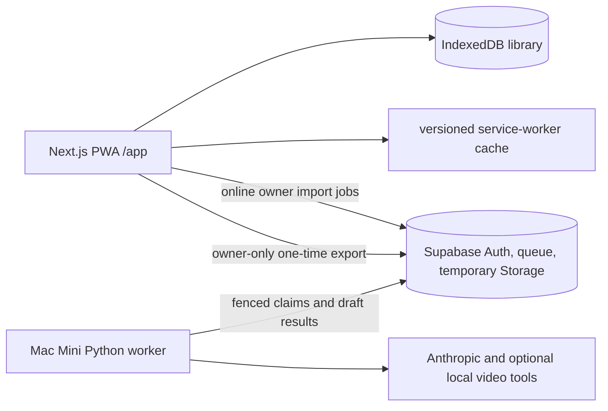

# Architecture — all-around-food

The personal app's everyday source of truth is IndexedDB in the browser profile that installed it. Next.js serves a cacheable `/app` shell; the service worker keeps a complete versioned shell and emitted static assets available offline. Hash routes open cookbook, edit, cook, plan, shopping, pantry, import, and settings screens. Recipe edits, cooking progress, meal occurrences, generated shopping, and pantry updates commit through the local repository. Backup export/restore covers all durable local stores, including drafts and cooking progress, but excludes pending upload blobs.

Supabase coordinates private, temporary imports. The online frontend uses only its public project URL and anon key. Owner access is enforced by Supabase policies and RPCs, not by a client-side owner claim. The worker uses private service-role and Anthropic keys on the Mac, claims jobs with a lease token, and publishes validated recipe drafts. The browser durably stores a draft before acknowledging its result, and explicit Save adds the recipe locally. The worker retries pending jobs and later cleanup when it reconnects. No routine cloud recipe mirror is part of this design. The initial owner-only cloud export is for non-destructive migration; old cloud records remain until a separately reviewed decision.

The separate FastAPI/Polars backend and pricing/evaluation/receipt OCR code remain in the repository for legacy and independent work. The personal `/app` core does not call them. Direct frontend Claude parsing routes return 410. Receipt OCR, pricing comparisons, SMS shopping text, and evaluations are outside the personal app navigation; their backend code and tests remain maintained separately.

A browser profile, device, or origin has its own library. A backup file transfers data manually; there is no synchronization. Browser storage can be evicted or cleared. The UI requests persistence where the browser supports it and prompts for backups. Offline use requires a successfully cached shell and does not make online imports available while disconnected. An installed iOS home-screen cold launch and update behavior still require observation on a physical device.

[ADR 0008](decisions/0008-local-first-pwa.md) remains Proposed until final architecture review. [The release record](testing/local-first-pwa-release.md) separates simulated and local checks from hosted, Mac, and physical-device gates. The merged migration order keeps dev evaluation stats at `0004` and the additive local draft protocol at `0005`. The old unfenced stale-recovery RPC is removed in `0005`. Actual hosted migration history must be checked before rollout; open PR #10's destructive queue migration is incompatible with this protocol.
