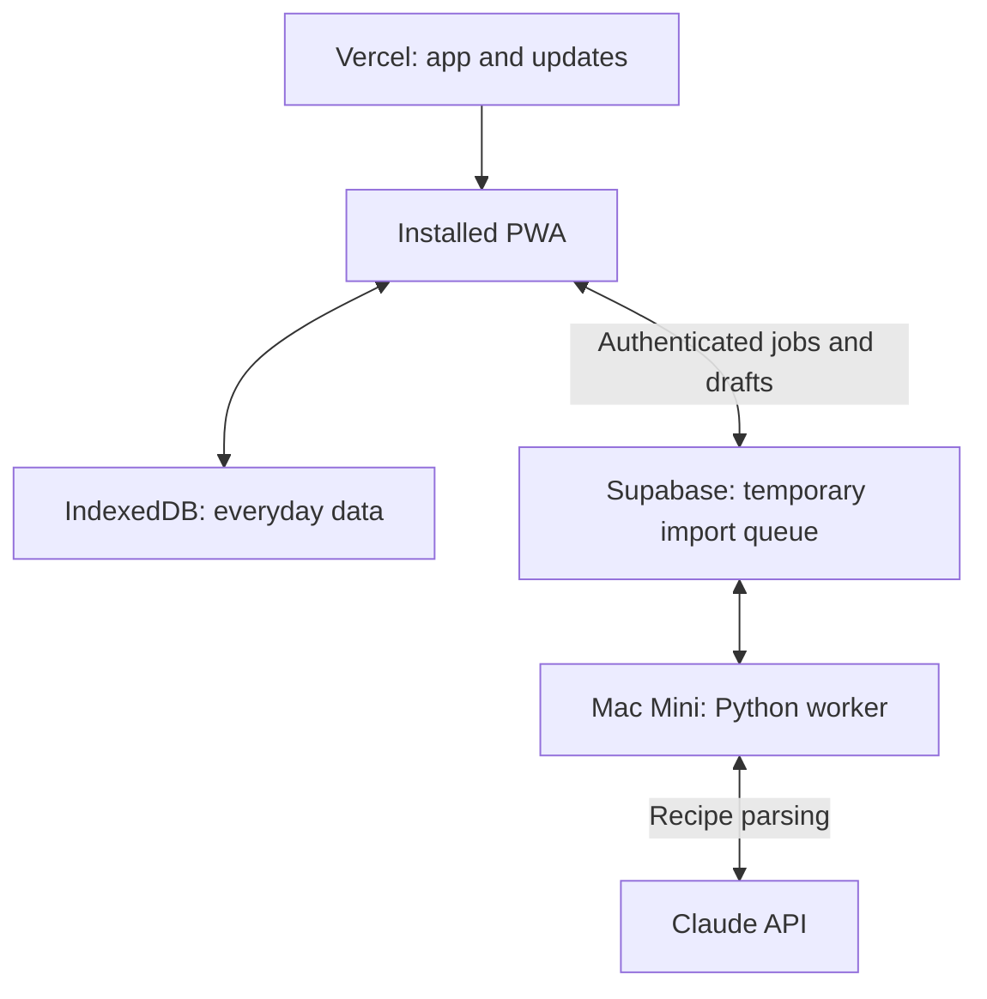

# Downloadable Local-First Cooking App Implementation Plan

> **For agentic workers:** Use `subagent-driven-development` to implement this plan task by task, with focused smaller-model implementers and review between tasks. Use `executing-plans` for tasks handled inline. Steps use checkboxes for tracking. This is a plan, not evidence of implementation or passing tests.

**Goal:** Install the app from its website, import and review a recipe using the Mac Mini, save it on-device, then reopen, cook, plan, and generate a shopping list offline.

**Architecture:** Retain Next.js/React and distribute a cached, client-rendered PWA from Vercel. IndexedDB owns everyday data. Supabase supplies private import access, temporary uploads, and a job queue; the existing Python worker runs on the user's Mac Mini and returns drafts rather than saving a cloud cookbook.

**Tech Stack:** Existing Next.js 16 / React 19 / TypeScript / Zod; IndexedDB with `idb`; existing service worker and Supabase clients; Python 3.12, yt-dlp, FFmpeg, whisper.cpp, Anthropic; macOS launchd. Verification uses existing Vitest / Playwright / pytest plus `fake-indexeddb` for storage tests.

**Status:** Ready for review; implementation has not started.

## Global constraints

- Personal use first. No Railway deployment, App Store build, billing, bring-your-own-key screen, multi-user product, or cross-device synchronization in this milestone.
- Preserve the repository, schemas, UI components, pure shopping logic, and useful extraction code. Do not start another application repository.
- Recipes, meal plans, shopping, pantry, and cooking progress work without Supabase, an active login, the Mac Mini, or internet access.
- Website, accessible public-video, screenshot, and pasted-text imports may use online processing. Manual recipe entry/editing works offline.
- Anthropic and Supabase service-role keys stay on the Mac Mini. Only public Supabase configuration belongs in the frontend.
- Reuse existing sign-in for import/migration access; disable public sign-ups and enforce the owner's access server-side. No new account-management product.
- Keep pantry statuses `in_stock | low | out`. No exact pantry depletion, receipt OCR, store pricing, nutrition inference, or product-matching work.
- Defer recipe photo storage: the current model has no image field. Use locally bundled visuals and avoid remote-image dependencies in offline screens.
- Migration copies and verifies existing data. Never automatically delete/overwrite the existing Supabase library or Parquet archives. Leave `.pnpm-store/` and `data/archive/` untouched.
- Node 22, pnpm 10, Python 3.12. Branches use `codex/`; PRs target `dev`; normal hooks and CI apply.
- Keep `AGENTS.md` and `CLAUDE.md` identical when changing them. Update folder context when its actual scope changes.

## Chosen setup

| Concern | Decision |
|---|---|
| Distribution | One stable HTTPS origin on Vercel; browser/home-screen installation |
| Offline navigation | One cacheable Next route, `/app`, with hash navigation such as `/app#/cookbook/recipe-id/cook` |
| Local persistence | Versioned IndexedDB; completed local transactions are authoritative |
| Cloud use | Existing-data export, private import access, temporary queue/uploads/results |
| Processing | One Mac Mini worker, one job at a time, supervised by launchd |
| Recipe imports | Local draft first, explicit Save; stable job IDs prevent duplicate delivery |
| Recovery | Backup/restore, worker leases, local draft committed before cloud acknowledgement |

The single `/app` shell avoids requiring an RSC request or generated server page for every locally created recipe. Keep Next hosting for online auth/export routes; do **not** set `output: 'export'`. Preserve legacy URLs with redirects after cutover. This is a narrow navigation adjustment, not a frontend rewrite.



## Current code that shapes the plan

- `frontend/src/lib/db/{recipes,meal-plans,shopping,pantry}.ts` are server-only Supabase modules. Core pages still load through them.
- `frontend/src/middleware.ts` applies the online sign-in gate broadly; the local shell/assets must bypass it.
- `frontend/public/sw.js` caches HTML and same-origin GETs broadly. It does not provide reliable never-visited recipe navigation or a durable local data layer.
- `frontend/src/components/plan/PlanView.tsx` deduplicates recipe IDs before shopping generation, undercounting the same recipe on two days. `shopping-logic.ts` joins distinct strings instead of adding serving-aware quantities.
- `ImportFlow.tsx` enqueues jobs; `ImportQueue.tsx` links to a cloud recipe inserted by the worker. The existing `RecipeReview.tsx` can be reconnected.
- `worker.py` supports `--watch --interval 30 --limit 1`; the existing launchd template instead runs Docker once daily.
- Migration `0003` claims pending jobs but has no expired-lease recovery. Its security-definer claim RPC needs explicit execute permissions.
- The July SwiftUI design is unimplemented and is superseded for this milestone by [ADR 0008](../../decisions/0008-local-first-pwa.md).

## Milestones and order

| Milestone | Tasks | Demonstration |
|---|---|---|
| A. Durable local app | 1–4 | Restore/manual-entry recipe; close app; reopen offline; edit and cook |
| B. Offline planning loop | 5 | Schedule repeated meals; generate shopping; complete purchases; update pantry |
| C. Online imports | 6–9 | Mac Mini returns a draft; review; save locally; recover from interruption |
| D. Personal release | 10 | Verified migration, real installed-device tests, backup round-trip, deployment |

Dependencies: `1 → 2 → 3 → 4`; `1 + 3 → 5`; `6 → 7`; `1 + 3 + 6 + 7 → 8`; `7 → 9`; all feed 10. Backend Tasks 6–7 may run alongside frontend Tasks 2–5. Agree on Task 6's shared contract before parallel edits. Each task should be one reviewable commit; do not merge until CI passes.

## File structure

Paths are repository-relative. New and existing files are distinguished in each task.

| Area | Planned files | Responsibility |
|---|---|---|
| Local data | `frontend/src/lib/local/{schema,db,repository,backup,migrate}.ts` | Validation, DB lifecycle, committed writes, backup and cloud copy |
| App shell | `frontend/src/app/(app)/app/page.tsx`, `frontend/src/components/app/{LocalApp,LocalScreens}.tsx`, `frontend/src/lib/local/navigation.ts` | One client shell, hash navigation, local screen loading |
| Views | Existing recipe, cook, plan, shopping, pantry components | Preserve UI; replace server mutations with local callbacks |
| Installation | `frontend/public/sw.js`, `frontend/scripts/build-pwa-manifest.mjs`, `ServiceWorkerRegister.tsx` | Complete precache, offline readiness, controlled updates |
| Import delivery | `frontend/src/lib/db/parseJobs.ts`, `frontend/src/lib/local/imports.ts`, existing import components | Authenticated jobs, resumable delivery, local drafts |
| Import protocol | `supabase/migrations/0004_local_recipe_drafts.sql`, `frontend/src/lib/import-schema.ts` | Temporary results, restricted RPCs, leases, acknowledgement |
| Processing | Existing Python worker, Supabase access, parser, video and config modules | Draft results, recovery, source extraction and cleanup |
| Mac operation | Existing `infra/worker/` docs/plist plus `install-macos-worker.sh` | Native worker supervision without mandatory Docker Desktop |

### Task 1: Add committed local storage and shared contracts

**Create:** `frontend/src/lib/local/schema.ts`, `db.ts`, `repository.ts`, `__tests__/repository.test.ts`; `frontend/src/lib/__tests__/fixtures/recipe.ts`.
**Modify:** `frontend/package.json`, `frontend/pnpm-lock.yaml`, `frontend/vitest.setup.ts`, `frontend/src/lib/meal-plan-schema.ts`, `frontend/src/lib/shopping-schema.ts`.

**Interfaces:** `getLocalDB()`, `closeLocalDB()`, `readSnapshot()`, `putRecipe(recipe)`, `saveMealPlan(plan)`, `saveCookProgress(progress)`. Mutations resolve only after transaction completion. Reuse Recipe/Pantry/Shopping schemas.

```ts
type CookProgress = {
  recipe_id: string;
  step: number;
  layout: 'step' | 'scroll';
  timer_end_at: number | null;
  paused_seconds: number | null;
};
type RecipeDraft = {
  id: string; // import job ID and eventual recipe ID
  recipe: Recipe;
  warnings: string[];
  received_at: string;
};
type LocalImport = {
  id: string;
  owner_id: string | null;
  kind: 'url' | 'video' | 'screenshot' | 'text';
  source_url: string | null;
  payload_text: string | null;
  upload: Blob | null;
  state: 'queued' | 'submitted' | 'draft' | 'saved' | 'error';
  acknowledged: boolean;
  error: string | null;
  created_at: string;
};
```

- [ ] Add `idb` and test-only `fake-indexeddb`: `pnpm --dir frontend add idb`; `pnpm --dir frontend add -D fake-indexeddb`. Import `fake-indexeddb/auto` in test setup. Keep resolved versions in the lockfile; add no sync or state-management framework.
- [ ] Define Zod contracts for the new types. Add `servings: z.number().positive().nullable().default(null)` to planned meals; add nullable `generated_week_of` to shopping items so regeneration can distinguish one week's output from manual entries.
- [ ] Create database `aaf-local`, version 1: stores `recipes` (key `id`), `meal_plans` (`week_of`), `shopping` (`id`), `pantry` (`id`), `cook_progress` (`recipe_id`), `drafts` (`id`), `imports` (`id`), `settings` (`key`). Settings contain JSON-compatible values, never credentials. Define `LibrarySnapshot` as arrays of durable stores plus settings, excluding pending imports/uploads.
- [ ] Add a fixture with the complete required recipe shape:

```ts
export function recipeFixture(): Recipe {
  return RecipeSchema.parse({
    id: 'recipe-1', title: 'Toast', description: null,
    source_url: null, source_attribution: null,
    prep_time_min: null, cook_time_min: null, total_time_min: null,
    servings: 1, yield_text: null,
    ingredients: [{ name: 'bread',
      quantity: { value: 2, unit: 'slice', as_written: '2 slices' },
      preparation: null, group: null, notes: null }],
    steps: [{ order: 1, instruction: 'Toast the bread.',
      duration_min: null, temperature_f: null }],
    cuisine: null, course: null, difficulty: null, nutrition: null,
    notes: null, storage_instructions: null,
    created_at: '2026-09-19T12:00:00Z', parse_confidence: null,
  });
}
```

- [ ] Write/run the regression before implementing storage:

```ts
it('retains a recipe after reopening the database', async () => {
  await putRecipe(recipeFixture());
  await closeLocalDB();
  expect((await readSnapshot()).recipes[0].title).toBe('Toast');
});
```

- [ ] Implement `openDB` with incremental upgrades, blocked-upgrade notification and closing older connections on versionchange. Validate before transactions. Use the following commit boundary, with no network work inside it:

```ts
const recipe = RecipeSchema.parse(input);
const db = await getLocalDB();
const tx = db.transaction('recipes', 'readwrite');
await tx.store.put(recipe);
await tx.done;
```

- [ ] Report quota/open/transaction errors visibly; never silently fall back to memory. Refresh mounted views after commit and on window focus; use BroadcastChannel for same-origin tab notifications. Test failed writes, upgrades, and multiple connections.
- [ ] Run `pnpm --dir frontend exec vitest run src/lib/local/__tests__/repository.test.ts`; expect reopen persistence and transaction-failure cases to pass. Commit: `feat: add local app storage`.

### Task 2: Add backup/restore and non-destructive Supabase migration

**Create:** `frontend/src/lib/local/{backup,migrate}.ts`, `frontend/src/components/settings/DataSettings.tsx`, `frontend/src/app/api/export/route.ts`, `frontend/src/lib/local/__tests__/{backup,migration}.test.ts`.

**Interfaces:** `exportBackup(): Promise<string>`, `restoreBackup(json: string, mode: 'merge' | 'replace'): Promise<MigrationReport>`, `migrateSupabaseLibrary(): Promise<MigrationReport>`. A report contains per-store inserted/skipped counts and validation errors. Replace requires explicit confirmation and a pre-restore backup; cloud migration always merges.

```ts
type BackupEnvelope = {
  format: 'all-around-food';
  version: 1;
  exported_at: string;
  library: LibrarySnapshot;
};
```

- [ ] Test a complete backup round-trip of recipes, referenced plans, pantry, shopping, drafts, settings and cooking progress. Reject malformed references, duplicate IDs and unknown future versions before any write.
- [ ] Read the snapshot in one readonly transaction. Validate with entity schemas and perform restore in one multi-store readwrite transaction. Existing local records win merge conflicts; report skipped records. Repeated migration must add no duplicates or overwrite subsequent edits.
- [ ] Implement owner-authenticated `GET /api/export`, marked `Cache-Control: no-store`. Read `recipes`, `meal_plans`, `planned_meals`, `pantry_items`, `shopping_list_items`; paginate past the default Supabase row limit. Join plan headers/children into MealPlan, preserve IDs/dates, default absent servings to null. Use the signed-in user's client, never the service-role key.
- [ ] Download the export before copying; show source/local counts and compare imported IDs and canonical field values. Pause edits in the legacy app while taking this personal migration snapshot so paginated reads cannot mix versions. Report orphan references rather than dropping them silently. Keep all existing cloud records and Parquet archives.
- [ ] Add storage-estimate/persistence-request controls and backup reminders. Explain that pending import uploads are excluded from backup. A refused persistence request does not block use; an unavailable database blocks Save with a clear error.
- [ ] Run `pnpm --dir frontend exec vitest run src/lib/local/__tests__/backup.test.ts src/lib/local/__tests__/migration.test.ts`; expect atomic rollback, idempotent migration, and local edits preserved. Commit: `feat: add library backup and migration`.

### Task 3: Connect cookbook and cook mode to a client shell

**Create:** `frontend/src/app/(app)/app/page.tsx`, `frontend/src/components/app/{LocalApp,LocalScreens}.tsx`, `frontend/src/lib/local/navigation.ts`, `frontend/src/lib/local/__tests__/navigation.test.ts`.
**Modify:** root layout/page; `frontend/src/app/(app)/_components/MobileTabBar.tsx`; middleware; existing RecipeDetail, RecipeEditForm, RecipeReview, CookMode, CookDoneView components and relevant tests.

**Interfaces:** `parseLocalRoute(hash)` returns a discriminated view: `plan`, `cookbook`, `recipe`, `edit`, `cook`, `shop`, `pantry`, `import`, `settings`; recipe views carry `recipeId`, plan may carry `weekOf`. `localHref(view, id?)` returns an `/app#...` URL. LocalScreens loads local records and passes async callbacks into views.

- [ ] Test encoded IDs, malformed URI encoding, unknown routes, back/forward, and `#/cookbook/new` for manual entry. Implement hashchange subscription with React; no generalized router framework.
- [ ] Render `/app` without request-time Supabase reads. Hydrate IndexedDB in LocalApp; distinguish loading, empty-library, and storage-error states. Eagerly import core views so first offline navigation does not need an unvisited lazy chunk.
- [ ] Replace core Next links/router mutations with hash links/local callbacks. Remove server-action and `server-only` imports from the LocalApp dependency tree. Preserve current presentation, accessible controls and responsive layout.
- [ ] Read detail/edit/cook from IndexedDB and show a local missing-recipe state when necessary. Reuse edit/review controls for offline manual entry; incomplete entries stay in the editor rather than using fabricated ingredients to pass validation.
- [ ] Save step/layout progress. Store timer end timestamps or paused seconds, recalculate on resume, and avoid promising background notifications. Count each completed cooking session once; repeated clicks/reloads must not increment twice.
- [ ] Exclude `/app` and assets from auth middleware network calls. The shell must work without Supabase config/session/network. Keep online auth/export routes protected. Validate auth return URLs as same-origin and return successful sign-in to `/app#/import`.
- [ ] Retain legacy routes until local replacements are ready, then redirect existing cookbook/detail/cook/edit/plan/shop/pantry/import URLs to matching hash routes. Do not continue writing to the old cloud stores from the installed app.
- [ ] Run navigation plus existing recipe/cook tests with `pnpm --dir frontend exec vitest run`. Inspect the client graph for server actions and secrets. Commit: `feat: connect cookbook to local app shell`.

### Task 4: Make installation, offline startup and updates reliable

**Create:** `frontend/scripts/build-pwa-manifest.mjs`, `frontend/playwright.pwa.config.ts`, `frontend/e2e/pwa-offline.spec.ts`.
**Modify:** `frontend/public/sw.js`, `manifest.webmanifest`, `ServiceWorkerRegister.tsx`, package scripts and DataSettings.

- [ ] Add a production-browser test that opens `/app`, waits for explicit offline-ready confirmation, goes offline, reloads, and navigates to a newly stored recipe never visited online. The existing dev-server pricing config cannot prove service-worker behavior.
- [ ] Generate the precache manifest after `next build` from emitted JS/CSS/fonts/icons plus `/app`. Key caches by build ID; do not guess chunk paths. Define `test:pwa` as `playwright test --config=playwright.pwa.config.ts`; its server runs the production build at a dedicated stable test port.
- [ ] Precache all required shell assets atomically; any missing required asset fails installation and leaves the old worker usable. Serve the installed release's cached `/app` for shell navigation. Cache only explicit assets; never cache `/api`, `/auth`, Supabase, authenticated HTML or non-GET requests.
- [ ] Replace immediate skipWaiting/reload with “Update available”. Activate only on user choice, after pending writes commit. Keep the previous release cache until its clients are gone; never clear IndexedDB during updates or interrupt cooking automatically.
- [ ] Manifest: `id: '/'`, `start_url: '/app'`, standalone display. Add platform-specific install instructions and browser install prompt where supported. Show offline readiness only when caching succeeds; request storage persistence after the first successful local save.
- [ ] Test with service workers allowed: offline cold start, never-visited recipe/cook route, browser restart with the same profile, failed update, and confirmed update preserving local data. Seed through normal manual/backup UI rather than a production test backdoor.
- [ ] Run `pnpm --dir frontend build` then `pnpm --dir frontend test:pwa`; expect the offline/update suite to pass. Commit: `feat: make installed app work offline`.

**Milestone A gate:** Manual/restored recipes survive closing the installed app and reopening offline; editing/cooking work with the network disabled. No destructive cutover before this gate.

### Task 5: Complete local planning, shopping and pantry

**Modify:** local repository, `shopping-logic.ts`, LocalScreens, PlanView/DayColumn/RecipePickerModal, ShoppingListView/AddFromRecipesModal/ShoppingRow, PantryView/PantryRow/PantryAddForm.
**Create:** `frontend/src/lib/local/__tests__/meal-shopping.test.ts`, `frontend/e2e/pwa-planning.spec.ts`.

**Interfaces:** `generateWeekShopping(weekOf: string): Promise<void>`, `completeShopping(itemIds: string[]): Promise<void>`, `setPantryStatus(id: string, status: PantryStatus): Promise<void>`. Pure `aggregatePlannedIngredients(plan, recipes, pantry)` returns shopping items tagged with `generated_week_of`.

- [ ] Test two occurrences of a 2-egg recipe produce 4 eggs; changed servings scale totals. Add null serving metadata, compatible-unit aliases, incomparable units, optional ingredients and pantry status cases.
- [ ] Remove the planner's recipe-ID deduplication. Preserve each occurrence; null target servings means the full original recipe. Scale only when base and target servings are both known/positive. Preserve original amounts otherwise and flag them for review.
- [ ] Sum numeric quantities only for the same normalized ingredient and compatible units. Initial conversions: kg→g ×1000, L→mL ×1000, lb→oz ×16, tbsp→tsp ×3; normalize singular/plural aliases. Leave cups and cross-system conversions separate when the source's measurement system is unknown. Never convert mass to volume without density. Keep unknown/text quantities as readable separate terms; do not deduplicate repeated identical demand strings.
- [ ] Regenerate only the chosen week's generated rows in one transaction, retaining manual entries and other weeks. Use deterministic item IDs; preserve checked status only if the ingredient/quantity signature is unchanged. Changed demand becomes unchecked.
- [ ] Present in-stock matches as reviewable covered items, low as suggestions to buy, out/unknown as needed. Do not infer pantry consumption from cooking. Manual status changes refresh shopping coverage.
- [ ] Finish shopping in one transaction: upsert selected purchased names as in_stock, preserve pantry notes/category overrides, and remove purchased list rows. Repeat completion must not duplicate pantry entries.
- [ ] Run `pnpm --dir frontend exec vitest run src/lib/local/__tests__/meal-shopping.test.ts` and `pnpm --dir frontend test:pwa`; expect the weekly loop to pass offline. Commit: `feat: complete offline planning and shopping`.

### Task 6: Make the import protocol private and recoverable

**Create:** `supabase/migrations/0004_local_recipe_drafts.sql`, `supabase/tests/local_recipe_drafts.sql`, `frontend/src/lib/import-schema.ts`.
**Modify:** Python Supabase helpers, `frontend/src/lib/db/parseJobs.ts` and its tests.

**Protocol fields:** Keep existing statuses. Add `result_recipe_json jsonb`, `result_warnings jsonb` array, `lease_until timestamptz`, `claim_token uuid`, `acknowledged_at timestamptz`, `expires_at timestamptz`. Retain legacy `result_recipe_id` for migration compatibility. Permit recipe kind `text`; do not persist keys or long-term transcripts in jobs.

- [ ] Write SQL integration tests for owner/other-owner/anonymous access, client denial of result/status/lease writes, and service-role-only claims. Use a disposable Supabase project and test accounts.
- [ ] Revoke authenticated table-level INSERT/UPDATE/DELETE privileges, then grant SELECT and column-level INSERT for `id`, `kind`, `source_url`, `storage_path`, `payload_text`; derive user_id from auth.uid(). Use owner-checked RPCs `retry_import_job(p_id)` and `ack_import_job(p_id)` for lifecycle mutations. Restrict the personal deployment to the configured owner and disable public sign-ups. Existing RLS still applies to reads/inserts; RPCs must check ownership explicitly.
- [ ] Revoke claim RPC execution from PUBLIC/anon/authenticated; grant only service_role. Claim one pending or expired-processing job with `FOR UPDATE SKIP LOCKED`, a fresh token, and a 10-minute lease. Renew every 60 seconds. Three attempts maximum; exhausted expired claims become visible errors rather than remaining processing forever.
- [ ] Define `finish_import_job` and `fail_import_job` requiring job ID, matching claim token and processing state. Finish atomically stores the validated draft and done status; recipe ID equals job ID. A stale worker cannot overwrite a newer attempt.
- [ ] Acknowledge only done jobs, idempotently, after local draft commit. Set unacknowledged result expiry to seven days from completion; pending/error uploads expire after 30 days; upload orphans expire after 24 hours. Worker cleanup removes acknowledged results and expired payloads. Expired jobs become `error` with message `Import expired; submit again`, keep only ID/owner/status/timestamps for seven more days, then are deleted. Client handling of a missing row must also show expiration, not silently resubmit work.
- [ ] Submit with stable locally generated UUIDs; on insertion conflict, read the existing owned row instead of overwriting result fields. Restrict upload paths to the owner and enforce media/size limits on both upload and worker sides.
- [ ] Execute the SQL suite with `psql "$AAF_TEST_DATABASE_URL" -v ON_ERROR_STOP=1 -f supabase/tests/local_recipe_drafts.sql`; the test script must require a separate explicit disposable-project guard before destructive setup. Never print/commit credentials. Commit: `feat: add secure transient recipe drafts`.

### Task 7: Adapt the worker and preserve source extraction

**Modify:** `backend/src/allaroundfood/{worker,supabase_client,config,video_import}.py`, `parsing/recipe_parser.py`, `backend/.env.example`, `backend/tests/test_worker.py`, `test_video_import.py`, `tests/parsing/test_recipe_parser.py`.

**Interfaces:** Python `finish_import_job(client, job_id, claim_token, recipe, warnings)`, `fail_import_job(client, job_id, claim_token, message)`, `cleanup_import_jobs(client)` use Task 6 RPCs. Add `parse_recipe_from_text(text)` beside existing parsers.

- [ ] Change worker tests to require result JSON and prohibit cloud recipe insertion. Cover write-before-cleanup order and already-completed result handling; support legacy result_recipe_id during migration.
- [ ] Replace `_handle_recipe_kind`'s insert_recipe call with atomic draft publication. Reuse yt-dlp caption/video, FFmpeg, whisper.cpp and Claude. Surface a warning when only captions were available; do not imply on-screen recipe text was extracted.
- [ ] Support pasted text. For websites, use supported Schema.org Recipe JSON-LD when available, then page text as needed. Bound bytes, redirects and processing time. Reject loopback/private/link-local destinations on each redirect to protect the Mac network; blocked pages get text/screenshot fallback instead of access-control bypass.
- [ ] Preserve the no-invention prompt and shared schema validation. Unknown amounts stay unknown. Insufficient ingredient/step evidence is a recoverable error or incomplete editor state, never a fabricated valid recipe. Keep source attribution/link.
- [ ] Configure `RUN_EVALS=false` and `IMPORT_OWNER_USER_ID` on the personal worker; reject jobs from another owner before fetching content or spending API credits. Preserve development judge tests. Do not write routine source-containing evaluations from this path.
- [ ] Keep leases alive while parsing; recover watch-loop network failures with 5/10/20/40/60-second bounded backoff. Isolate per-job errors. Ensure stale workers cannot publish after losing their claim.
- [ ] Clean local video/audio in finally blocks. Remove uploaded sources only after durable result publication. Cleanup failure must not mark a successful parse failed. Retry acknowledged/expired-result and orphan cleanup each watch cycle; removal waits while the Mac is offline, which the docs must explain.
- [ ] Test parser errors, caption-only warning, crash-before-finish, stale completion, attempt exhaustion and cleanup failure. From `backend`, run `uv run pytest tests/test_worker.py tests/test_video_import.py tests/parsing/test_recipe_parser.py`. Commit: `feat: return recoverable local recipe drafts`.

### Task 8: Deliver imports into local review and explicit Save

**Create:** `frontend/src/lib/local/imports.ts`, `frontend/src/lib/local/__tests__/imports.test.ts`, `frontend/e2e/pwa-import.spec.ts`.
**Modify:** existing ImportFlow/ImportQueue/DropZone/RecipeReview, local repository and LocalScreens.

**Interfaces:** `queueLocalImport(input): Promise<LocalImport>`, `flushLocalImports(): Promise<void>`, `receiveImportDraft(job): Promise<void>`, `acceptDraft(jobId: string, editedRecipe: Recipe): Promise<Recipe>`.

- [ ] Test that done-job delivery creates a draft, not a cookbook recipe. Acknowledgement must follow the IndexedDB commit; a failed local write leaves the remote result available.
- [ ] Persist the request UUID before submission. Keep screenshot Blob locally until upload is confirmed. Flush only while foregrounded/online; resume when reopened. No reliance on iOS background-sync availability.
- [ ] Bind submitted requests to their signed-in owner; do not send one owner's queued media under another account. Expired sign-in pauses imports and preserves local requests; cookbook remains usable.
- [ ] Poll every five seconds while visible with outstanding jobs; stop otherwise. Resume by stored IDs. Validate and commit remote results as local drafts before acknowledgement; repeated delivery preserves edits to an existing draft. Mac processing continues when the PWA closes.
- [ ] Reuse review controls with warnings and editable fields. Save in one transaction over recipes/drafts/imports. Set recipe ID to job ID. Repeated Save returns the existing recipe without overwriting subsequent edits.
- [ ] Show expired/missing results as explicit retry states. Retain URLs/text; if local uploaded media was already cleared, request reselection. Provide retry, pasted text, screenshot, and manual entry. Direct video-file upload is a follow-up; this loop keeps existing URL/screenshot paths.
- [ ] Mock Supabase responses for CI. Test offline submit, close/reopen, expired sign-in, duplicate delivery, failed local write and explicit Save. Run `pnpm --dir frontend exec vitest run src/lib/local/__tests__/imports.test.ts` and `pnpm --dir frontend test:pwa`. Commit: `feat: review imports before saving locally`.

### Task 9: Supervise the recipe worker on the Mac Mini

**Modify:** `infra/worker/README.md`, `com.allaroundfood.worker.plist`, `backend/context.md`, `infra/context.md`, `backend/.env.example`.
**Create:** `infra/worker/install-macos-worker.sh`.

- [ ] Use native Python/FFmpeg on the Mac Mini initially. Invoke the absolute backend virtualenv Python path from launchd. Preserve the Dockerfile for later hosting; Docker Desktop is not required. Recipe startup must not load Qwen/torch or require OCR weights, even if legacy dependencies remain installed.
- [ ] Generate the plist using Python plistlib with resolved paths. WorkingDirectory is the backend checkout so `.env` resolves. Set RunAtLoad and KeepAlive true, ThrottleInterval 30, private log paths, and remove daily scheduling. Arguments:

```text
backend/.venv/bin/python (resolved absolute path)
-m
allaroundfood.worker
--watch
--interval
30
--limit
1
```

- [ ] Check Python 3.12, FFmpeg, yt-dlp, required configuration names without printing secrets, and the downloaded whisper base.en model. Store owner-readable secrets on the Mac; set RUN_EVALS=false. Do not copy secrets to Vercel.
- [ ] Validate generated plist with `plutil -lint`. Provide exact bootstrap/kickstart/print/bootout commands using its real path. A LaunchAgent starts after that user logs in, not before FileVault unlock/login. Explain sleep settings; do not silently change power settings.
- [ ] Installation on the actual Mac Mini is an execution step, not something implied by writing a template. Discover its checkout/access before loading launchd. Verify a queued job, restart after process kill, waiting while the Mac is off, recovery on return, and lease recovery after mid-job termination.
- [ ] Keep all connections outbound; no public ports/tunnels. Commit repo changes as `ops: supervise personal Mac Mini imports`. Report service installation/running status only with evidence from that machine.

### Task 10: Verify the loop, migrate and release

**Modify:** `.github/workflows/ci.yml`, README, folder context files, `AGENTS.md`, `CLAUDE.md`, `docs/architecture.md`, project task/changelog tracking.
**Create:** `docs/testing/local-first-pwa-release.md` with dated observed outcomes.

- [ ] Add frontend typecheck, non-watch unit tests, and production PWA Playwright tests to CI with browser installation. Preserve backend/docs-sync checks. Keep existing pricing tests separate, not deleted merely to make new tests pass.
- [ ] Run the complete checks after the loop is connected:

```sh
pnpm --dir frontend lint
pnpm --dir frontend exec tsc --noEmit
pnpm --dir frontend exec vitest run
pnpm --dir frontend build
pnpm --dir frontend test:pwa
```

From `backend`:

```sh
uv run ruff check
uv run mypy
uv run pytest
```

- [ ] Verify an installed PWA on a real iPhone/iPad and desktop: airplane-mode cold launch; never-visited recipe; edit/save; cooking progress; repeated meal planning; shopping generation/completion; reopen. Test a fresh-profile backup restore, sign-out offline, database upgrade with another tab, and app update during cooking. Simulated WebKit does not establish home-screen installation support.
- [ ] Reuse the Vercel project where available. Keep production origin stable once real data is local. `dev` is staging, `main` release. Retain only public Supabase frontend configuration; remove frontend Anthropic/service-role secrets and disable obsolete public inline parsing endpoints.
- [ ] Apply additive Supabase changes in a disposable project first. Stop the old worker before draft-protocol cutover; coordinate worker/frontend versions. Preserve old results and copy their recipes through migration. Keep cloud originals and an exported backup. Rollback must not direct local-only edits into old cloud writers.
- [ ] Copy and verify the actual library in the target installed app. Explain that another browser/device has separate local storage; backups transfer data but are not sync. Document storage-clearing and device-loss recovery.
- [ ] Run a live website import and accessible Instagram link through the real Mac Mini. Record caption/transcript availability and latency. If download is blocked, verify a fallback; do not claim universal Instagram support. Confirm local receipt precedes cloud cleanup and no ongoing cloud recipe mirror remains.
- [ ] Update actual architecture/context/deploy docs; keep canon files identical. Hide pricing/evaluation/receipt paths in the personal app without rewriting their backend. Make ADR 0008 Accepted after review. Promote the project tracking item only when the release gate passes; use the existing `scripts/done.py` process.
- [ ] Commit, open a PR targeting dev, and merge only with required CI green. Publish through the established deployment path; record anything requiring unavailable device/project access as unverified rather than complete.

## Acceptance gate

- [ ] Install from a stable website URL without an App Store account.
- [ ] Copy existing cloud data with verified counts/contents and no destructive changes.
- [ ] Local data survives app close, browser restart, offline reload and app update.
- [ ] Open/edit everyday records without a login or network request.
- [ ] Open/cook newly created recipe IDs offline without visiting them online first.
- [ ] Website/accessible Instagram imports yield editable drafts; text/screenshot/manual fallbacks work.
- [ ] Closing the app does not cancel submitted jobs; reopening retrieves results.
- [ ] Offline intents survive; submission, delivery and Save retries do not duplicate recipes.
- [ ] Repeated meals and serving changes produce correct shopping demand.
- [ ] Purchased items update pantry atomically, preserving unrelated items.
- [ ] Backup restores all durable stores, including drafts and cooking progress.
- [ ] Secrets remain on the Mac; unauthorized users cannot access or claim import jobs.
- [ ] Mac sleep/offline and worker crashes are recoverable.
- [ ] Automated checks and real installed-device observations are recorded.

## Execution inputs

Final setup needs the actual Mac Mini checkout/access, stable Vercel origin, Supabase project/owner and physical-device access. Inspect available configuration before asking for missing values. These do not block local development or require Railway. This planning pass has not inspected live Supabase contents, provisioned hosting, installed a worker, or run application tests.

## References

- [Next SPA guidance](https://nextjs.org/docs/app/guides/single-page-applications) and [static-export limitations](https://nextjs.org/docs/app/guides/static-exports).
- [IndexedDB lifecycle](https://developer.mozilla.org/en-US/docs/Web/API/IndexedDB_API/Using_IndexedDB), [idb transactions](https://github.com/jakearchibald/idb), and [fake-indexeddb](https://github.com/dumbmatter/fakeIndexedDB).
- [PWA installation](https://developer.mozilla.org/en-US/docs/Web/Progressive_web_apps/Guides/Making_PWAs_installable) and [storage persistence/eviction](https://developer.mozilla.org/en-US/docs/Web/API/Storage_API/Storage_quotas_and_eviction_criteria).
- [Schema.org Recipe](https://schema.org/Recipe).
