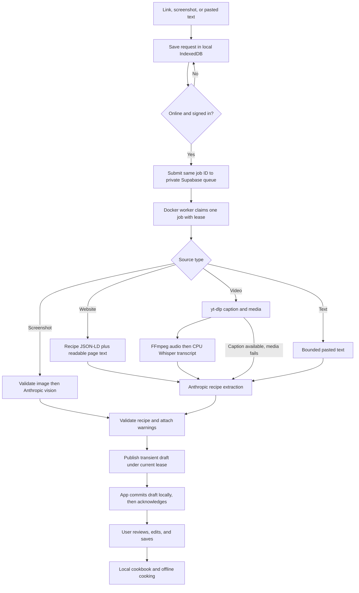

# Recipe Parsing Pipeline Implementation Plan

> **For agentic workers:** Use `subagent-driven-development` or `executing-plans` to implement one task at a time. Use a small implementation agent for bounded changes and one review per completed task; do not restart a whole-project review after each change. Steps use checkboxes for tracking.

**Goal:** An owner can submit a website, supported social-video link, screenshot, or recipe text, receive an editable recipe draft, save it locally, and use it offline; a CPU-only Docker worker processes the remote queue reliably.

**Architecture:** Keep the existing PWA, IndexedDB library, Supabase transient queue, and Python parsers. Run one continuously polling Docker Compose worker on the Mac Mini initially, with a persistent Whisper model volume and Anthropic parsing. Keep the same container usable on a Linux server later.

**Tech Stack:** Next.js/React/TypeScript, IndexedDB, Supabase Auth/Postgres/Storage, Python 3.12, Docker Compose, yt-dlp, FFmpeg, pywhispercpp, Anthropic SDK, Pydantic and Zod.

**Status:** Superseded in part by the user's September 24 decision to remove Anthropic. Do not execute the Anthropic-dependent extraction, vision, or configuration tasks below. The [Jev experiment](../../experiments/2026-09-24-jev-recipe.md) records the first replacement prototype; production-plan revision awaits its review. The remaining architecture is a proposal based on `6e7d1b5`, not evidence of installation or deployment.

## Decisions and global constraints

- Personal owner only. Saved recipes and everyday app data remain on-device; no cloud library synchronization.
- CPU-only background processing; a longer wait is acceptable. Start with one active import, a 30-second idle poll, four transcription threads, and `base.en` for English speech. Benchmark before changing these defaults.
- Reuse the implemented pipeline. Docker packaging and operational verification replace the proposed native launchd installation; the frontend architecture stays the same.
- No worker HTTP server, inbound ports, tunnels, Redis, Celery, Kubernetes, or paid hosting prerequisite.
- The worker makes outbound requests to Supabase, Anthropic, and permitted source sites. The frontend holds only public Supabase configuration.
- Keep `SUPABASE_SERVICE_ROLE_KEY`, `ANTHROPIC_API_KEY_PARSING`, and `IMPORT_OWNER_USER_ID` private on the worker host. Never bake them into the image, logs, source control, or frontend.
- yt-dlp minimum and lock are already updated to `2026.8.19`. Freeze dependency installation to the reviewed lockfile; do not silently update at container startup.
- Preserve the existing owner checks, outbound destination checks, token-fenced leases, idempotent job IDs, durable local receipt before acknowledgement, and explicit Save.
- Do not promise every recipe site or Instagram reel is accessible. No comments, video-frame OCR, browser-cookie extraction, account login automation, receipt OCR, pricing, billing, or multi-user service in this release.
- Read migration history before hosted changes. Keep `0004_evaluation_stats.sql`; do not apply PR #10's incompatible `0004_queue_only.sql`. Do not rewrite already-applied migrations.
- Existing automated checks establish component behavior, not a completed live deployment. Keep those evidence categories separate.

## Why this approach

| Approach | Trade-off | Decision |
|---|---|---|
| One Compose worker on the Mac Mini | Repeatable setup and a clear path to Linux hosting; Mac and Docker must stay running | Selected |
| Native Python plus launchd | Fewer runtime layers and access to native acceleration; more machine-specific installation | Existing fallback, not the target |
| Hosted worker immediately | Better independence from the Mac; adds hosting setup and cost | Defer until availability warrants it |

## Current evidence: what to reuse

| Component | Actual state |
|---|---|
| Local import queue and draft review | Implemented in `frontend/src/lib/local/imports.ts` and `LocalImports.tsx`, with regression tests |
| Remote jobs, ownership, leases, cleanup | Implemented through `0005_local_recipe_drafts.sql`; hosted history and configuration are unverified |
| Website, text, screenshot, video parsers | Implemented; real end-to-end parsing with the intended private credentials remains unverified |
| Instagram extraction | On September 23, the supplied `DboNc-8CTox` reel downloaded with yt-dlp `2026.08.19`, including a 1,554-character caption and approximately 9.8 MB of video, without cookies |
| CPU transcription | Library and FFmpeg were present locally; neither checked default model directory contained a model. No CPU timing or transcription quality result yet |
| Docker worker | `backend/Dockerfile.worker` exists, defaults to `--once`, installs the broad backend dependency set, and has not been validated for this release |
| Runtime configuration | No matching native worker process/LaunchAgent was found on the Mac Mini; required private settings were missing from the inspected `.env` |

The working reel download is an extraction result, not evidence that transcription, AI parsing, cloud delivery, or local Save has completed.

## End-to-end flow



The source-specific parsing stage returns a validated `Recipe` plus warnings. Job state and remote writes stay in the supervising worker. The parser never saves directly to the user's library.

## Source behavior and recipe quality

| Input | Extraction | Failure/fallback |
|---|---|---|
| Website | Preserve source URL; prioritize Recipe JSON-LD and use bounded readable HTML as supporting evidence | Explain inaccessible or empty pages; offer pasted text or screenshot |
| Instagram/supported social video | Preserve creator/caption metadata; download an allowed direct media stream; extract mono audio; transcribe on CPU; label caption and transcript separately for the parser | If metadata was obtained but media/audio/transcription fails, use its caption with a warning. If neither source is usable, fail visibly and offer text/screenshot |
| Screenshot | Verify MIME, actual decodable image, dimensions, owner storage path, and existing 10 MB size cap | Reject corrupt/unsupported/oversized images; preserve the ability to choose a replacement |
| Pasted text | Trim and bound input; use the same recipe schema and validation | Reject empty input or content with no recipe evidence |

Use the current `claude-haiku-4-5` parser first; do not add a second model or automatic judge. Keep `RUN_EVALS=false`. Preserve raw amount text, unknown quantities as null, source attribution, ordered instructions, and ingredient references used in cooking mode. Unknown amounts and conflicting source evidence should produce review warnings, not invented quantities. Self-reported model confidence is advisory, not proof of accuracy.

Treat imported text as untrusted source material, not instructions to the application. Keep the forced recipe tool and validate its result. Handle truncated/malformed output and insufficient evidence as useful errors. The current 30,000-character combined text cap must not allow a long caption to silently eliminate all transcript evidence.

## State, durability, and recovery contract

Existing local states remain `queued`, `submitted`, `draft`, `saved`, `error`, and `replaced`. Remote states remain `pending`, `processing`, `done`, and `error`. Add optional remote-status observations for display rather than replacing the queue protocol.

| User sees | Meaning and action |
|---|---|
| Saved on this device | Request is durable locally; online transfer has not completed |
| Sign in / Waiting for connection | The app cannot currently submit or collect results; local data remains usable |
| Waiting to process | Remote row is `pending`; worker availability is reported separately |
| Processing | Remote row is `processing`; no fake percentage or completion estimate |
| Ready to review | Draft is durably stored on this device |
| Could not import | A safe explanation plus explicit retry or source replacement |
| Saved | Explicit Save completed in the local cookbook |

- Submit with the same job UUID on network retries. Duplicate delivery must not overwrite review edits or create a second recipe.
- Retain the screenshot Blob until remote row creation is confirmed. A locally queued request survives closing the app.
- Sync only while the app is online and foregrounded. The worker can continue while the app is closed; result retrieval resumes when it reopens. No background iOS polling promise.
- Keep the existing 10-minute lease and 60-second renewal. Lease expiry is not the job duration limit: a healthy CPU job may renew while it works.
- Add a 20-minute configurable whole-job deadline as a conservative initial limit. Measure it against the real CPU test before release; terminate hung parsing so one job cannot block the queue indefinitely.
- Retain the database's three-claim ceiling. A worker crash can be reclaimed after lease expiry; ordinary parser failures become explicit errors with user-controlled retries. Bound SDK/network retries within the job deadline rather than introducing another automatic requeue scheduler.
- Only the current claim token may publish, fail, renew, or update job progress. On lease loss, stop the parser child and discard its output.
- A crash after a paid API call can cause that call to be repeated. The guarantee is safe/idempotent result delivery, not exactly-once external API billing.
- Preserve current retention: pending jobs expire after 30 days; completed uncollected results after 7 days. After local acknowledgement, cloud result/source cleanup is eligible. Expired jobs explain resubmission. Cleanup is delayed while the worker is unavailable.

## Implementation tasks

### Task 1 — Verify configuration and queue compatibility before activation

**Files:** Read `supabase/migrations/0001_init.sql` through `0005_local_recipe_drafts.sql`; update `supabase/README.md` and `docs/testing/local-first-pwa-release.md`; create `backend/scripts/check_import_setup.py` and `backend/tests/test_import_setup.py`.

**Deliverable:** A read-only preflight that returns exit 0 only when required configuration, model file, tools, and intended queue schema are ready. It prints setting names and failure categories, never values. It must not claim jobs or call Anthropic.

- [ ] Write preflight cases for missing keys/model, mismatched configured/database owner, unavailable Supabase, and missing draft/lease columns. Assert no mutating RPCs occur.
- [ ] Implement the preflight using `Settings`, binary discovery, a small owner/schema read, and local model readability. Check the authenticated frontend and worker point at the intended same project during operator setup.
- [ ] Inspect hosted `supabase_migrations.schema_migrations` and record exact history before drafting commands for that target. Run existing SQL fixtures against a disposable target first.
- [ ] Prepare a concrete migration/owner-configuration checklist and backup record. Apply only reconciled migrations to the confirmed target during activation, not while writing this plan. Stop any old queue worker before applying the lease upgrade.
- [ ] Verify owner, other-user, and anonymous access, including storage uploads, result reads, and the service-role-only claim/finish functions.
- [ ] Run `cd backend && uv run pytest tests/test_import_setup.py -q`; require all preflight cases to pass. Commit code/docs separately from any hosted operation.

Configuration required locally: `SUPABASE_URL`, `SUPABASE_SERVICE_ROLE_KEY`, `ANTHROPIC_API_KEY_PARSING`, `IMPORT_OWNER_USER_ID`, `RUN_EVALS=false`, `WHISPER_MODEL=base.en`, and `WHISPER_MODELS_DIR=/models/whisper`. The owner UUID must match `app_private.import_owner`. Keep signup restricted to the intended owner.

### Task 2 — Make one repeatable CPU-only Docker service

**Files:** Modify `backend/Dockerfile.worker`; create `compose.worker.yaml`, `backend/scripts/prepare_whisper_model.py`, and `backend/.dockerignore` if absent; update `infra/worker/README.md`, `infra/context.md`, `backend/context.md`, `README.md`, and add `docs/decisions/0009-containerized-import-worker.md`.

**Deliverable:** A buildable image plus `worker` Compose service that polls continuously. Keep the existing Python worker entrypoint and override its command with `--watch --interval 30 --limit 1`.

- [ ] Pin a tested Python 3.12 image and uv release, and install with `uv sync --frozen`. Keep compilation in the builder stage. Initially preserve the existing dependency lock; do not mix a broad pricing/OCR dependency reorganization into container activation.
- [ ] Exclude `.env*`, virtualenvs, model files, caches, and local data from the build context. Run as an unprivileged user with a writable `/models/whisper` volume and temporary workspace. Publish no ports.
- [ ] Use `restart: unless-stopped`, `init: true`, a 30-second shutdown grace period, and bounded log rotation. Start with four CPUs and an 8 GiB memory limit, subject to the measured validation in Task 7 and host capacity.
- [ ] Load the private environment from an ignored owner-readable file on the host. Use a named volume for the downloaded model; download/verify it once in an explicit preparation command, not unexpectedly in the middle of a user job. The model-preparation script exits successfully without redownloading an already verified model.
- [ ] Add a proposed ADR for this change from launchd to Compose; keep native install instructions clearly labeled as the alternative. If editing `AGENTS.md` or `CLAUDE.md`, update both identically.
- [ ] Build and smoke-test on the Mac's Linux ARM64 container runtime. Verify imports of pywhispercpp and the worker, `ffmpeg -version`, and `yt-dlp --version`; no paid calls needed. Validate Linux AMD64 separately before claiming that hosting target is supported.
- [ ] Confirm image history/build context excludes private credentials and that restarting the container retains the model volume. Commit after the image actually builds.

Target operator commands, after files exist and configuration is ready:

```sh
docker compose -f compose.worker.yaml build worker
docker compose -f compose.worker.yaml run --rm --entrypoint python worker scripts/prepare_whisper_model.py
docker compose -f compose.worker.yaml run --rm --entrypoint python worker scripts/check_import_setup.py
docker compose -f compose.worker.yaml up -d worker
docker compose -f compose.worker.yaml logs --tail=100 worker
```

The Dockerfile must copy the two scripts into `/app/scripts`. The Mac still needs Docker running and must remain awake; test restart after login/reboot rather than assuming a restart policy starts Docker itself. On Linux, enable the Docker service at boot during that later deployment.

### Task 3 — Bound CPU work and recover from hangs

**Files:** Modify `backend/src/allaroundfood/worker.py`, `config.py`, `transcription.py`, and `parsing/recipe_parser.py`; create `backend/src/allaroundfood/import_process.py`; extend `backend/tests/test_worker.py`, `test_transcription.py`, and create `test_import_process.py`.

**Interfaces:** The parsing child accepts one validated source job and produces a JSON object `{recipe, warnings}` in a private temporary result file. The parent validates `recipe` with `Recipe`, checks its claim, and calls existing `finish_import_job(client, job_id, claim_token, recipe, warnings)`. Only the parent owns Supabase queue operations. Preserve the current four source kinds.

- [ ] Write regressions for a parser that hangs, a child that exits unsuccessfully, malformed child output, claim loss during parsing, and SIGTERM. Use short injected deadlines; tests must not wait 20 minutes.
- [ ] Extract the existing source-dispatch parsing code into the child entrypoint without changing its public recipe schema. Bound result-file size and do not place credentials or pasted recipe content in process arguments. Pass only the configuration needed by the child.
- [ ] Keep claim renewal in the parent while the child runs. On deadline or lease loss, terminate the child process group including yt-dlp/FFmpeg descendants and clean temporary files. Never publish output from a lost lease.
- [ ] Add `WORKER_JOB_TIMEOUT_S=1200` and `WHISPER_THREADS=4`. Configure CPU mode using the supported API of the locked pywhispercpp version; verify actual Linux runtime behavior. Do not assume a GPU argument belongs in transcription parameters.
- [ ] Set explicit Anthropic request timeout and bounded retries within the job budget; retain no automatic judge. On shutdown stop claiming, stop child work, and leave unfinished claims to the existing lease-recovery protocol.
- [ ] Run `cd backend && uv run pytest tests/test_worker.py tests/test_transcription.py tests/test_import_process.py -q`. Verify a hung import does not prevent the next valid queued item from eventually completing. Commit.

### Task 4 — Make extraction fallbacks and recipe warnings truthful

**Files:** Modify `backend/src/allaroundfood/video_import.py`, `models.py`, `parsing/recipe_parser.py`, and the source dispatch from Task 3; extend `backend/tests/test_video_import.py`, `tests/parsing/test_recipe_parser.py`, and `test_worker.py`.

**Interfaces:** Preserve the current `VideoImportResult` caption/transcript/source fields. Add `warnings: list[str]` with an empty default, carry them to the existing draft-warning list, and keep `Recipe` compatible with `frontend/src/lib/recipe-schema.ts`.

- [ ] Write source fixtures for Recipe JSON-LD, ordinary HTML, a caption with a working transcript, a usable caption with failed media/audio/transcription, no evidence, a misleading promotional caption, image input, and pasted text. Add a long-caption case that still supplies transcript evidence.
- [ ] Preserve caption metadata before attempting media/audio work. The current `_download_video`/audio path can fail before caption fallback runs; separate those stages enough to return a caption-only result when appropriate.
- [ ] Allocate the 30,000-character video evidence budget across caption and transcript, redistributing unused space. Label both sources, report truncation, and preserve source attribution. Remove the prompt's suggestion that comments or OCR were collected when they were not.
- [ ] Keep existing URL/DNS/redirect/private-address controls and direct-media restrictions. Retain the 100 MB media cap and 180-second external command timeouts, with Task 3's whole-job budget as the outer limit.
- [ ] Add explicit extraction-only prompt instructions. Preserve unknown amounts; warn about missing quantities, caption-only evidence, conflicting text, or incomplete instructions. Fail when there are no supported ingredients or steps rather than fabricating a full recipe.
- [ ] Keep screenshot parsing on Anthropic vision; do not add Qwen or video-frame OCR. Confirm runtime image decoding/size validation before model submission.
- [ ] Run `cd backend && uv run pytest tests/parsing/test_recipe_parser.py tests/test_video_import.py tests/test_safe_ytdlp.py tests/test_worker.py -q`. Run shared recipe fixtures through frontend Zod validation. Commit.

### Task 5 — Expose worker availability and real queue status

**Files:** Create `supabase/migrations/0006_import_worker_status.sql` and `supabase/tests/import_worker_status.sql` after confirming no numbering collision; modify `backend/src/allaroundfood/worker.py`, `supabase_client.py`, `frontend/src/lib/db/parseJobs.ts`, `frontend/src/lib/local/schema.ts`, `imports.ts`, and `frontend/src/components/app/LocalImports.tsx`.

**Tests:** Extend `backend/tests/test_supabase_client_imports.py`, `test_worker.py`, `frontend/src/lib/local/__tests__/imports.test.ts`, and `frontend/src/components/app/__tests__/LocalImports.test.tsx`.

**Interfaces:** Add an owner-readable worker-status row containing only `owner_id` and server-assigned `last_seen_at`. A new `report_import_worker_heartbeat()` RPC takes no client-selected owner or timestamp and permits service-role execution only. An owner-only read RPC returns `available` and `last_seen_at`, with availability evaluated against database time. Add optional `remote_status` and `remote_checked_at` to local imports with defaults compatible with existing stored rows.

- [ ] Add SQL cases proving anonymous/other-user reads fail, browser writes fail, and a worker cannot set client-supplied owner/timestamps. Keep this status separate from per-job lease renewal.
- [ ] Report heartbeat every 30 seconds during idle and active processing. Consider it fresh for 120 seconds. A missing/stale heartbeat means "Worker hasn't checked in recently," not proof the Mac is powered off. A failed status request means status is unknown.
- [ ] Record remote `pending`/`processing` observations while the foreground import sync already polls. Show last-checked context when offline rather than pretending cached status is current. Do not persist writes repeatedly when observations have not meaningfully changed.
- [ ] Display actionable sign-in, connection, waiting, processing, review, retry, and expired-source states. Do not display raw provider stack traces or signed URLs. Never infer worker availability from a pending queue alone.
- [ ] Add local process-health reporting for operators without extra HTTP ports. A Docker healthcheck reports state only; actual hang recovery comes from Task 3, not from expecting healthcheck failure to restart the container automatically.
- [ ] Run the disposable SQL fixture and focused backend/frontend tests. Verify processing stays responsive while a CPU job is active. Commit.

### Task 6 — Prove draft delivery and local Save across interruptions

**Files:** Reuse and extend only where missing: `frontend/src/lib/local/__tests__/imports.test.ts`, `frontend/src/components/app/__tests__/LocalImports.test.tsx`, `frontend/e2e/pwa-import.spec.ts`, `frontend/e2e/pwa-offline.spec.ts`, `supabase/tests/local_recipe_drafts.sql`, and `docs/testing/local-first-pwa-release.md`.

- [ ] Map existing coverage before writing tests. Keep working queue/draft/save code unless a missing regression reveals a real defect.
- [ ] Exercise closing the app after submission, reopening after remote completion, network failure during submission, and account switching. The same UUID must remain attached to its original owner.
- [ ] Inject an IndexedDB commit failure during draft receipt: no acknowledgement may be sent. Retry receipt successfully, then prove duplicate delivery preserves edited draft fields.
- [ ] Exercise save followed by a late remote response, reload during review, acknowledgement network failure, expired screenshots, and exhausted retries. Preserve the existing atomic replacement behavior for reselected screenshots.
- [ ] Save a recipe, close/reopen offline, and verify ingredients, steps, and cooking quantities. Run the existing PWA import/offline tests against a production fixture build, then record the real-device version of this flow during Task 7.
- [ ] Commit only any required fixes and new missing coverage; do not duplicate already-proven scenarios merely to increase test count.

### Task 7 — Activate and verify one real complete pipeline

**Files:** Update `docs/testing/local-first-pwa-release.md` and `infra/worker/README.md` with observed results. Use the existing owner account and stable app origin; do not move the local library to a different URL for this test.

- [ ] Complete the reconciled hosted setup from Task 1 and status migration from Task 5, confirm private host configuration, prepare the model, and run preflight. Do not print keys or use another project's credentials as placeholders.
- [ ] Start only the Compose worker. Confirm lease ownership, startup after Docker restarts, model persistence, and bounded logs.
- [ ] Submit one pasted recipe, one website, one screenshot, and the user's reel through the actual app. The reel is `https://www.instagram.com/therealchadli/reel/DboNc-8CTox/`; if access changes, record its error and use a permitted accessible clip for the CPU benchmark.
- [ ] For each, verify queue → processing → local draft → review/edit → Save → offline reopen. Compare ingredient amounts, servings, ordered steps, inline ingredient references, and attribution against the source. A successful API response alone does not pass.
- [ ] Record media duration, caption availability, transcript quality, extraction/transcription/AI/total timings, peak container memory, CPU settings, model versions, and API token usage. Do not invent a cost estimate before usage and current pricing are known.
- [ ] Interrupt the worker mid-job, restart it, and observe reclaim after lease expiry without duplicate local recipes. Interrupt cloud access; verify no false completion and eventual cleanup. Test a deliberately timed-out parser with a fixture rather than waiting for a real service to hang.
- [ ] On the iPhone, collect the result, save it, reopen in airplane mode, and cook from it. Confirm a cloud result is not removed before local durable receipt; check acknowledgement cleanup separately from expiry.
- [ ] Run required checks once at the integrated candidate: backend Ruff/mypy/pytest, frontend lint/typecheck/unit/build/PWA, container smoke tests, SQL fixtures, and canon sync. Record omissions honestly; do not repeat unrelated full suites after docs-only edits.

**Release acceptance:** All four inputs produce reviewable local recipes, or a truthful actionable source error; CPU work completes within the configured budget on an accessible sample; crash/hang/network recovery passes; credentials remain private; local recipes survive offline reopen; deployment and backup/rollback steps are documented.

## Operations and rollback

- Keep one active worker. Tag images with the tested commit, record the previous image, and make updates deliberate. Run fixture checks and a sample extraction when updating yt-dlp; no unattended startup upgrades.
- Stop the new worker before rolling back. Restart a previously validated image only if it supports the current lease/draft schema; never restart the old cloud-recipe writer. Preserve Supabase rows, model volumes, and local libraries.
- Use `docker compose ... stop worker` for a pause. Avoid `down -v`, which removes volumes. Already-submitted jobs remain queued subject to the documented retention.
- If startup fails because configuration/model/schema is missing, show the exact missing requirement in private operator logs and remain unavailable to the app. Do not spend API calls discovering an invalid setup through real jobs.
- Fresh heartbeat is evidence of worker contact, not proof that a particular source can be imported. Keep source failures visible separately.
- For a future Linux move, provision the same settings/model, test the target architecture, stop the Mac worker, start the validated server image, and observe queue recovery. The app URL and on-device data do not change.

## What the owner needs to provide

1. Confirm the Supabase project and owner account to use; allow read-only inspection of its migration history before changes.
2. Place the Supabase service-role key and Anthropic parsing key in the private worker environment locally. Provide the owner UUID there as well. Do not send secret values through chat.
3. Keep Docker running and choose the Mac Mini's awake/startup behavior while it acts as the worker host.
4. Perform the short physical iPhone review/save/offline check. No Instagram login/cookies are currently needed for the tested reel.

The implementer can prepare code, tests, container packaging, model provisioning, and documentation before these inputs are ready. Hosted activation and real paid parsing depend on the correct private configuration.

## Scope deliberately deferred

Automatic cloud library sync; multiple users; billing/BYOK UI; notifications; multiple workers; progress percentages; video-frame OCR; direct video-file upload; Instagram cookie management; receipt/pricing pipelines; scheduled hosting migration; model-evaluation dashboards. Keep screenshot, pasted text, and manual editing as the supported source fallbacks.

## Reference documentation

- [Docker Compose service settings](https://docs.docker.com/reference/compose-file/services/) — service command, healthcheck, logging, resource and restart settings.
- [Docker restart behavior](https://docs.docker.com/engine/containers/start-containers-automatically/) — process exit/restart semantics and manual stops.
- [pywhispercpp API](https://absadiki.github.io/pywhispercpp/) — model loading and CPU/context configuration; check against the locked installed version before implementation.
- [yt-dlp 2026.08.19](https://github.com/yt-dlp/yt-dlp/releases/tag/2026.08.19) — the installed extraction update; runtime success on the sample is recorded separately above.
