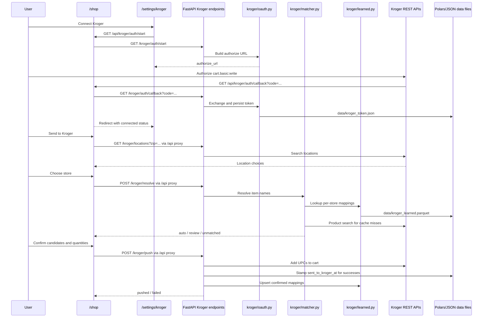

# Kroger Shopping List Integration Design

Date: 2026-05-23
Status: Draft for review

## 1. Goal & Scope

Build a dev-mode Kroger integration that pushes the current All Around Food shopping list into a single user's Kroger cart with one intentional action from `/shop`.

Version 1 is intentionally narrow:

- Single local/dev user only. No account table, tenant model, or production auth hardening.
- Per-push store selection. The selected Kroger store is not remembered globally.
- Hybrid resolution. The app auto-matches clear items, asks the user to review ambiguous items, and surfaces unmatched items before pushing.
- Learned mappings per store. When a user confirms a mapping, the app reuses it for the same normalized item name and Kroger location.
- Quantity defaults to `1`. Existing `quantity_text` is displayed as a hint, not converted into package quantities in v1.
- Shopping-list rows get a new `sent_to_kroger_at` timestamp so "sent" is distinct from `checked`.
- A persistent "Prefer budget options" setting applies a soft price bonus during matching, but learned mappings short-circuit before scoring.

## 2. Out of Scope

- Reading the Kroger cart back into All Around Food. Kroger Cart API is write-only for this use case.
- Multi-user auth, production account linking, or server-side session isolation.
- Walmart or other stores. Walmart is punted because there is no comparable public consumer-cart API.
- Pickup/delivery slot selection, checkout, payment, substitutions, coupons, order status, or order tracking.
- Automatic recipe quantity/unit conversion into Kroger package counts.
- Persistent preferred store, multi-store memory, or reorder history.

## 3. Architecture

Add a Kroger backend package at `backend/src/allaroundfood/kroger/`, expose Kroger routes from the FastAPI app, and add a frontend drawer plus a settings page.

The backend owns OAuth tokens, Kroger API calls, matching, learned mappings, settings, and shopping-list mutations. The frontend owns the guided user flow: connect status, zip lookup, store choice, review candidates, quantity steppers, and final push feedback.

The design follows current repo patterns:

- FastAPI request/response models live close to route handlers unless a shared domain model is needed.
- Polars-backed stores use immutable read -> mutate -> write behavior like `ShoppingListStore` and `PantryStore`.
- Pydantic models and frontend Zod schemas mirror user-facing data shapes.
- Frontend server components may fetch the backend directly; client interactions should go through typed helpers in `frontend/src/lib/api.ts` backed by thin `/api/*` proxies.
- Kroger product/store taxonomy stays in Kroger-specific models and must not overload the app's narrow `Aisle` literal.

## 4. Backend Module Layout

Create `backend/src/allaroundfood/kroger/` with these files:

- `__init__.py`
  - Package marker and public exports as needed.

- `client.py`
  - Thin HTTP wrapper over Kroger REST APIs.
  - Methods: build authorize URL inputs are handled by `oauth.py`; fetch locations by zip; search products by term and location; add UPCs to cart.
  - No business logic, scoring, persistence, or shopping-list mutation.
  - Never logs access tokens, refresh tokens, client secrets, or full request headers.

- `oauth.py`
  - Authorization Code flow and refresh logic.
  - Reads `KROGER_CLIENT_ID`, `KROGER_CLIENT_SECRET`, and `KROGER_REDIRECT_URI` from `backend/.env` / process env.
  - `KROGER_REDIRECT_URI` should point at the frontend callback route in dev, for example `http://localhost:3000/api/kroger/auth/callback`.
  - Persists the single dev user's token to `data/kroger_token.json`.
  - Exposes connect status as `{connected, expires_at}`.
  - Refreshes before API calls when expired or close to expiry.
  - Includes a banner comment that this is dev-only single-user storage and must be replaced before production auth.

- `matcher.py`
  - Converts shopping-list item names to Kroger UPC candidates.
  - Resolution order:
    1. Normalize item name.
    2. Check learned cache for `(item_name_normalized, location_id)`.
    3. If found, return a learned match and skip product search/scoring.
    4. Search Kroger products for misses.
    5. Score candidates.
    6. Split results into `auto`, `review`, and `unmatched`.
  - Scoring inputs should include text similarity, Kroger relevance/order, availability at the selected location when provided by the API, price when present, and optional budget preference.
  - "Prefer budget options" is a soft bonus, not a hard sort. It must not override learned mappings.
  - Threshold constants live in this module and are covered by unit tests.

- `learned.py`
  - Polars-backed CRUD for `data/kroger_learned.parquet`.
  - Schema:
    - `id: str`
    - `item_name_normalized: str`
    - `upc: str`
    - `product_description: str`
    - `location_id: str`
    - `last_used_at: datetime`
    - `use_count: int`
  - Upsert is scoped by `(item_name_normalized, location_id)`.
  - Delete by `id` powers the settings page clear action.
  - Settings UI displays `item_name_normalized` as the item name in v1; preserving the original display name can be added later if needed.

- `service.py`
  - Orchestrates resolve and push flows.
  - Loads shopping-list rows by requested IDs.
  - Calls `matcher` for resolution.
  - Pushes confirmed UPCs to Kroger cart through `client`.
  - Stamps `sent_to_kroger_at` only for items successfully added to cart.
  - Updates learned mappings from the product metadata included in confirmed push items. The push contract must include enough metadata to avoid relying on stale in-memory resolve state.
  - Returns partial-success results instead of failing the entire push on one item failure.

- `settings.py`
  - Single-user settings store at `data/kroger_settings.json`.
  - Shape: `{ "prefer_budget": boolean }`.
  - Defaults to `false` if the file does not exist.

## 5. API Endpoints

Add Kroger route handlers to `backend/src/allaroundfood/api.py`. If `api.py` grows too large during implementation, move route bodies into a `kroger/routes.py` router and register it from `api.py`; the external API remains the same.

Existing backend style is currently direct `@app.get/post/...` handlers in `api.py` plus monkeypatchable store-path helpers. Match that style for the first implementation unless the route file becomes unwieldy.

### Auth

- `GET /kroger/auth/start`
  - Returns `{authorize_url: string}`.
  - Authorize URL includes scope `cart.basic:write` and the configured redirect URI.

- `GET /kroger/auth/callback?code=...`
  - Exchanges the code for tokens, persists `data/kroger_token.json`, and returns `{connected: true, expires_at: string}`.
  - This is a backend JSON endpoint. The browser-facing callback is the frontend `/api/kroger/auth/callback` proxy described below.

- `GET /kroger/auth/status`
  - Returns `{connected: boolean, expires_at: string | null}`.
  - Does not expose token values.

- `POST /kroger/auth/disconnect`
  - Deletes local token storage if present.
  - Returns `{connected: false}`.

### Locations

- `GET /kroger/locations?zip=...`
  - Returns nearby Kroger locations for a zip code.
  - Bad or empty zip returns a typed 400 response.
  - Expired tokens are refreshed before calling Kroger.

### Resolve

- `POST /kroger/resolve`
  - Request:

```json
{
  "item_ids": ["item-1", "item-2"],
  "location_id": "01400943"
}
```

  - Response:

```json
{
  "auto": [
    {
      "item_id": "item-1",
      "item_name": "milk",
      "quantity_text": "1 gallon",
      "selected": {
        "upc": "0001111040101",
        "description": "Kroger 2% Milk",
        "score": 0.94,
        "learned": false
      },
      "candidates": []
    }
  ],
  "review": [
    {
      "item_id": "item-2",
      "item_name": "cheddar",
      "quantity_text": "8 oz",
      "candidates": [
        {
          "upc": "0001111055511",
          "description": "Kroger Shredded Mild Cheddar Cheese",
          "score": 0.81,
          "price": 2.99,
          "image_url": null
        }
      ]
    }
  ],
  "unmatched": [
    {
      "item_id": "item-3",
      "item_name": "fresh basil",
      "quantity_text": "1 bunch",
      "reason": "No Kroger products found"
    }
  ]
}
```

### Push

- `POST /kroger/push`
  - Request:

```json
{
  "location_id": "01400943",
  "items": [
    {
      "item_id": "item-1",
      "upc": "0001111040101",
      "quantity": 1,
      "product_description": "Kroger 2% Milk",
      "selection_source": "auto"
    }
  ]
}
```

  - `selection_source` is one of `learned`, `auto`, or `review`.
  - `product_description` is required for learned-cache upsert after a successful cart add.

  - Response:

```json
{
  "pushed": [
    {
      "item_id": "item-1",
      "upc": "0001111040101",
      "sent_to_kroger_at": "2026-05-23T18:40:22Z"
    }
  ],
  "failed": [
    {
      "item_id": "item-2",
      "upc": "0001111055511",
      "reason": "Kroger rejected item"
    }
  ]
}
```

### Settings

- `GET /kroger/settings`
  - Returns `{prefer_budget: boolean}`.

- `PUT /kroger/settings`
  - Request/response: `{prefer_budget: boolean}`.

### Learned Mappings

- `GET /kroger/learned`
  - Returns learned mappings for the settings page.

- `DELETE /kroger/learned/{id}`
  - Deletes a learned mapping.
  - Returns `{deleted: true}` with status 200 on success so the existing Next proxy can forward JSON consistently.

## 6. Schema Changes

### Shopping List Item

Add `sent_to_kroger_at: datetime | None = None` to backend `ShoppingListItem`.

Add `sent_to_kroger_at: z.string().nullable().default(null)` to `frontend/src/lib/shopping-schema.ts`.

Update `ShoppingListStore` columns:

- Add `sent_to_kroger_at` as nullable `pl.Datetime("us", "UTC")`.
- For old parquet files, missing column defaults to null.
- Reads and writes preserve null until a successful push stamps the field.

### Learned Mappings

Create `data/kroger_learned.parquet` with:

- `id`
- `item_name_normalized`
- `upc`
- `product_description`
- `location_id`
- `last_used_at`
- `use_count`

### Settings and Token Files

Create JSON stores only when needed:

- `data/kroger_token.json`
- `data/kroger_settings.json`

All three Kroger data files are local dev artifacts and must be ignored by git.

## 7. Frontend

### `/shop`

Add a "Send to Kroger" control near the shopping-list header/actions.

- Reuse the existing disabled "Send to Kroger" anchor in `ShoppingListView` if it is still present when implementation begins.
- Disabled when Kroger is not connected.
- Tooltip or adjacent status text explains that the user must connect Kroger in settings.
- Opens `KrogerPushDrawer` when connected.
- V1 push scope is all currently visible rows where `checked === false` and `sent_to_kroger_at === null`.
- No independent item-selection checklist is added in v1. The review step is where the user excludes items by leaving them unmatched/skipped before pushing.

### `/settings/kroger`

Add a settings page with:

- Connection status.
- Connect button using the frontend helper for `GET /api/kroger/auth/start`, then browser navigation to the returned authorize URL.
- Disconnect button using the frontend helper for `POST /api/kroger/auth/disconnect`.
- Persistent "Prefer budget options" toggle using frontend helpers for `GET/PUT /api/kroger/settings`.
- Learned mappings list with item name, product description, location id, last used, use count, and a clear action.

This route is dev-oriented but should still match the app shell's typography, palette, and navigation conventions.

### `KrogerPushDrawer`

Create `frontend/src/components/kroger/KrogerPushDrawer.tsx` and supporting files if needed.

Flow:

1. Zip entry.
2. Store picker populated by the frontend helper for `GET /api/kroger/locations`.
3. Resolve selected shopping-list items via the frontend helper for `POST /api/kroger/resolve`.
4. Show three sections:
   - Auto: selected UPCs with scores and quantity steppers.
   - Review: radio-list candidates, quantity steppers, and item hints.
   - Unmatched: no product selected; user can skip for v1.
5. Push confirmed items via the frontend helper for `POST /api/kroger/push`, including `product_description` and `selection_source` for each pushed UPC.
6. Show result toast with pushed count and failed count.
7. Refresh shopping-list state so newly sent rows show their `sent_to_kroger_at` status.

Quantity behavior:

- Default every selected cart quantity to `1`.
- Display `quantity_text` beside each item as a hint.
- Allow simple integer stepper changes before push.

### Zod Contracts

Create `frontend/src/lib/kroger-schema.ts` with Zod schemas for:

- Auth status.
- Settings.
- Location list items.
- Resolve request/response.
- Candidate product.
- Push request/response.
- Learned mapping list items.

Add matching Next `/api/kroger/*` proxy routes for client components, following the existing shopping-list proxy pattern and Next 15 dynamic `params: Promise<...>` convention where dynamic params are needed.

The browser-facing OAuth callback is:

- `GET /api/kroger/auth/callback?code=...`
  - Forwards the code to FastAPI `GET /kroger/auth/callback?code=...`.
  - On success, redirects to `/settings/kroger?connected=1`.
  - On failure, redirects to `/settings/kroger?error=oauth`.

All settings and drawer client calls should use `frontend/src/lib/api.ts` helpers that target `/api/kroger/*`, not the FastAPI backend URL directly.

## 8. Data Flow



## 9. Error Handling

| Case | Backend behavior | Frontend behavior |
|---|---|---|
| Token expired | Refresh token before Kroger call; if refresh fails, clear/mark disconnected and return 401 | Show reconnect prompt and disable push |
| Revoked token | Treat as auth failure, do not retry endlessly | Show reconnect prompt |
| Rate limit | Return 429 with retry guidance if available | Show "Kroger is rate limiting requests" and allow retry later |
| Zero-hit product search | Put item in `unmatched` with reason | Show in unmatched section; item is skipped |
| Per-item cart failure | Continue pushing remaining items; include item in `failed` | Toast partial success; keep failed items unsent |
| Network/5xx from Kroger | Return typed 502/503 problem; do not stamp items | Show retryable failure |
| Bad zip | Return 400 with validation detail | Keep user on zip step and show inline error |
| Missing location | Return 400 | Require store selection before resolve/push |
| Missing local token | Return 401 | Send user to settings/connect |
| Missing shopping-list item | Return 404 or per-item failure depending endpoint | Refresh list and ask user to retry |

## 10. Security & Safety

- Add these files to `.gitignore` during implementation:
  - `data/kroger_token.json`
  - `data/kroger_settings.json`
  - `data/kroger_learned.parquet`
- `oauth.py` must include a dev-only banner comment explaining that local token JSON is a single-user development shortcut.
- Read secrets from `backend/.env` or environment:
  - `KROGER_CLIENT_ID`
  - `KROGER_CLIENT_SECRET`
  - `KROGER_REDIRECT_URI`
- Never log client secrets, access tokens, refresh tokens, authorization codes, or full Kroger request headers.
- Use least-privilege OAuth scope: `cart.basic:write`.
- The frontend never receives Kroger tokens.

## 11. Testing Strategy

### Backend Unit Tests

- `matcher`
  - Learned mapping short-circuits search/scoring.
  - Thresholds split auto/review/unmatched correctly.
  - Budget preference applies a soft score bonus.
  - Budget preference is bypassed for learned hits.

- `oauth`
  - Expiry math.
  - Refresh path.
  - Status shape without token leakage.
  - Missing env values fail loudly.

- `learned`
  - Create empty parquet.
  - Upsert increments `use_count`.
  - Lookup is scoped by location.
  - Delete by id.

- `service.push`
  - Successful items get `sent_to_kroger_at`.
  - Failed items do not get stamped.
  - Partial failure returns both `pushed` and `failed`.
  - Learned cache updates after confirmed successful pushes.

### Integration Tests

- Live Kroger tests are gated behind `KROGER_LIVE=1`.
- CI default leaves live tests off.
- Mock Kroger client responses for normal unit and API tests.

### Frontend Tests

- Required v1 verification uses `pnpm lint && pnpm build` plus manual mocked-flow QA unless frontend test tooling is introduced in the implementation plan.
- If component-test tooling is added, cover `KrogerPushDrawer` cases for:
  - disconnected/disabled state,
  - zip/store selection,
  - auto/review/unmatched rendering,
  - candidate radio selection,
  - quantity steppers,
  - partial-success toast.
- If Playwright is added, include an E2E path with backend Kroger calls mocked.
- Verify the settings page toggle changes resolve requests/results in mocked flow.

### Manual Smoke Checklist

1. Add Kroger env vars to `backend/.env`.
2. Connect a dev Kroger account from `/settings/kroger`.
3. Add 2-3 shopping-list items.
4. Open `/shop`, enter zip, choose a store, and resolve.
5. Confirm review candidates and push.
6. Verify successful items appear in the Kroger cart.
7. Verify successful All Around Food rows have `sent_to_kroger_at`.
8. Verify failed/unmatched rows remain unsent and retryable.

### Repo Verification

Before implementation is considered done:

- `pnpm lint && pnpm build`
- `uv run ruff check && uv run mypy && uv run pytest`
- No `__PLACEHOLDER__` tokens.
- CI green on `dev`.

## 12. Acceptance Criteria

- A connected dev user can push visible, unchecked, unsent shopping-list items to Kroger cart from `/shop`.
- The user reviews ambiguous product matches before push.
- Learned mappings are reused per store and can be cleared from settings.
- `sent_to_kroger_at` is stamped only after successful Kroger cart additions.
- "Prefer budget options" persists and affects scoring only when no learned mapping exists.
- Token files, settings files, and learned parquet are gitignored.
- Live Kroger calls are opt-in for tests and never required in CI.

## 13. Open Questions / Future Work

- Multi-user auth and production token storage.
- Remembering preferred stores and supporting multiple store-specific histories.
- Walmart fallback via deep links or manual export if no public cart API emerges.
- "Reorder last push" shortcut.
- Quantity conversion from recipe amounts to Kroger package quantities.
- Better handling for substitutions, coupons, sale prices, and brand preferences.
